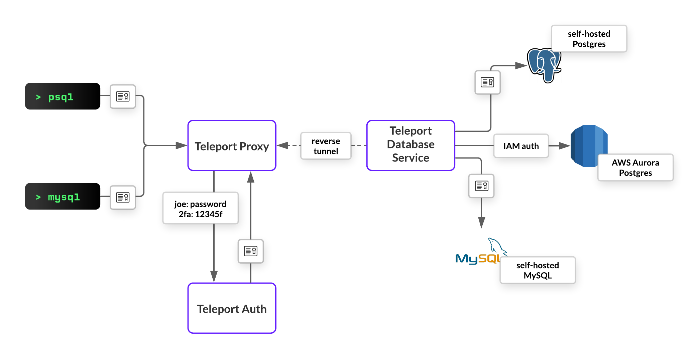

# Database Access Architecture

## Diagram

The following diagram shows an example Database Access setup:

* Root cluster provides access to an onprem instance of PostgreSQL.
* Leaf cluster, connected to the root cluster, provides access to an
  onprem instance of MySQL and PostgreSQL-compatible AWS Aurora.
* Node connects another on-premise PostgreSQL instance (perhaps, a
  metrics database) via tunnel to the root cluster.

## RFD

Please refer to the [RFD document](https://github.com/gravitational/teleport/blob/024fd582e62560ffc925cd4b4d42c156043c041b/rfd/0011-database-access.md)
for a more in-depth description of the feature scope and design.
